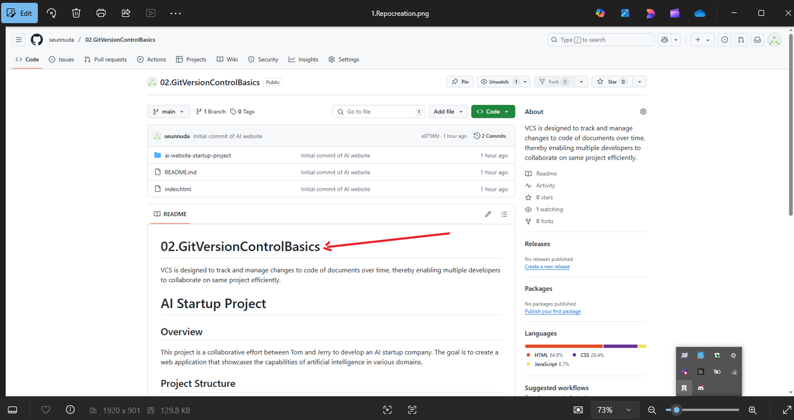
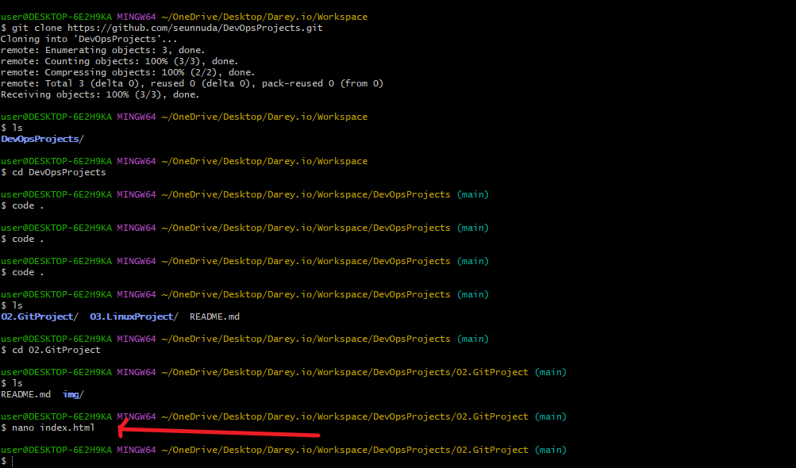
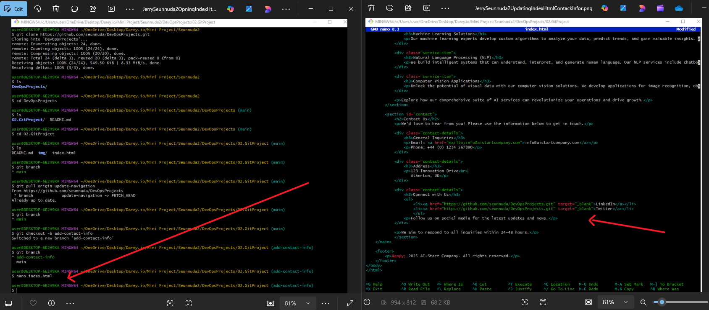

#AI-STARTUP-WEBSITE

##This is the creation of a website for an AI startup company that involve collaborative work with Tom & Jerry. The website includes various sections like Home, About us, Services, and Contact Information.

Creating Repository

Cloning Repository

Creating An Index.Html file

Preview of Website Creation

Staging Commit&Pushing Project to Remote Repo

Invitation To Tom (Seunnuda1)& Jerry (Seunnuda2)for Collaboration

Tom(Seunnuda1) Copying Repo

Tom(Seunnuda1) Cloning Repo & Create Branch Update Navigation

Tom Update Navigation Index.html file

Tom Stage Commit & Push Updated Navigation Index.html To Remote Repo

Jerry(Seunnuda2) Accepting Invitation & Copy Repo for Cloning

Jerry(Seunnuda2) Cloned Repository & Creating Branch Add-Contact-Info

Jerry Updating Contact Info In Index.Html

Jerry Stage Index.Html Commit And Push Origin Contact Info To Main Repo

Seunnuda Reviewing And Pull Request Tom's (Seunnuda1) Branch To Merge With Main Branch After Resolving Any Conflick If Any

Seunnuda Reviewing Jerry's Add-Contact-Info Branch

