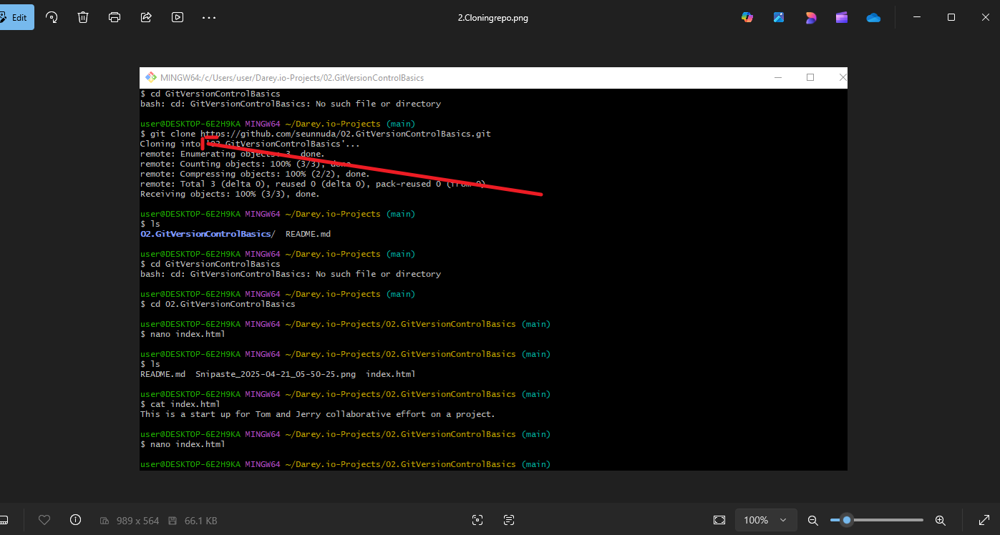
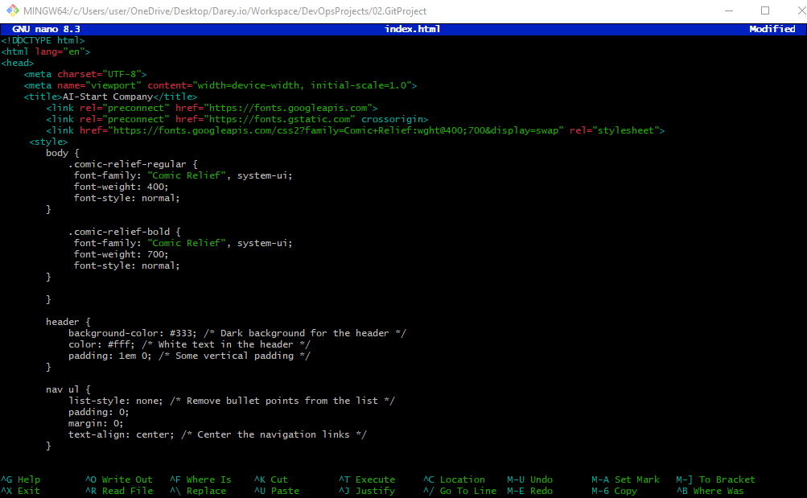
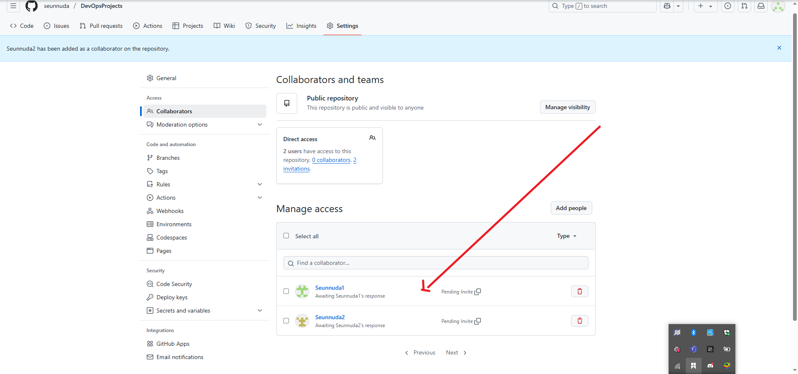

#AI-STARTUP-WEBSITE

##In this project, we will create a step by step project to stimulate Tom and Jerry using Git and GitHub.This hands-on project will include installation of Git, setting up a GitHub repository, cloning the repository, creating branches, making changes, and merging those changes back into the main branch.. 

Creating a Remote Repository for a website for an AI startup company. The website includes various sections like Home, About us, Services, and Contact Information.

Cloning Repository to local machine.

Creating An Index.Html file where codes are written

Preview of Website Creation

Staging Commit&Pushing Project to Remote Repository

Invitation To Tom and Jerry for Collaboration

Tom Accepted and Copying Repo

Tom Cloning Repo & Create Branch Update Navigation

Tom Update Navigation Index.html file

Tom Stage Commit & Push Updated Navigation Index.html To main branch

Jerry Accepting Invitation & Copy Repo for Cloning

Jerry Cloned Repository and Creating Branch Add-Contact-Info

Jerry Updating Contact Info In Index.Html

Jerry Stage Index.Html Commit And Push Origin Contact Info To Main Repo

Reviewing And Pull Tom's Request Branch To Merge With Main Branch

Reviewing Jerry's Add-Contact-Info Branch
PullRequest Jerry's Branch Add-Contact-Info

Request Pulled After Reviewed

PulledRequest Merged To Main Branch

Jerry's Add Contact Info Branch Successfully Merged To Main Branch

Final Web Designed.

